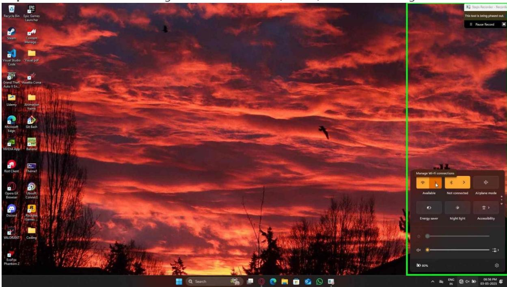

**Step 1:** User left click on "Quick settings (group)" in "Quick settings"

Step 1 screenshot.

**Step 2:** User left click on "Manage Wi-Fi connections (button)" in "Quick settings"

Step 2 screenshot.

**Step 3:** User left click on "Jio510\_5G , secured, signal 0 out of four bars (list item)" in "Quick settings"

Step 3 screenshot.

**Step 4:** User left click on "Connect (button)" in "Quick settings"

Step 4 screenshot.

**Step 5:** User left click on "Jio510\_5G Connected, secured , secured, signal 4 out of four bars (list item)" in "Quick settings"

Step 5 screenshot.