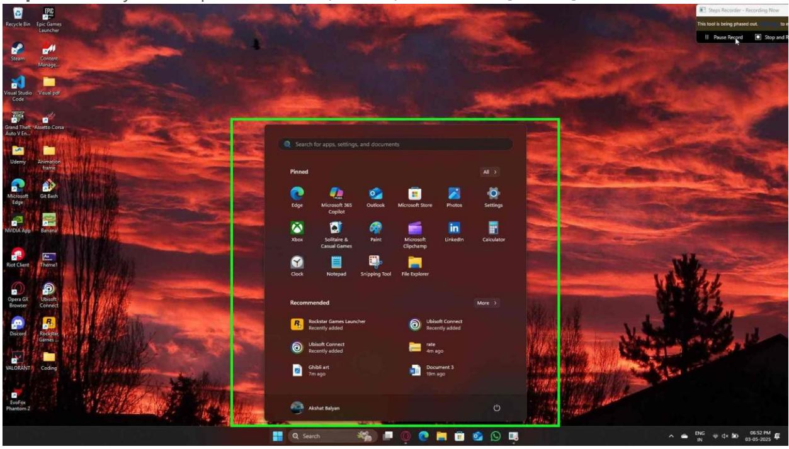
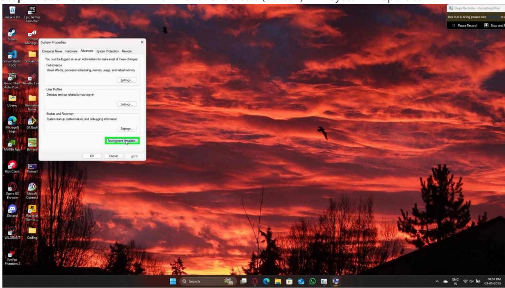
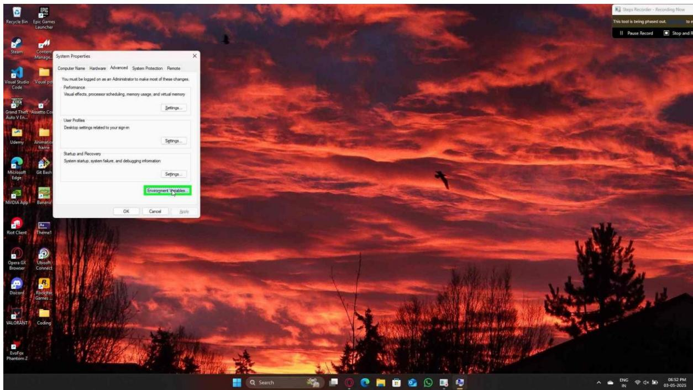
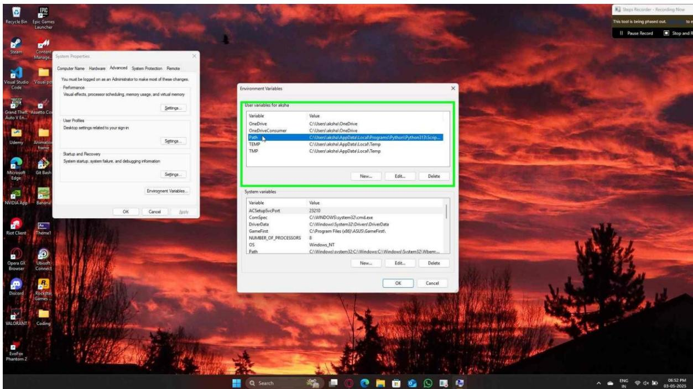
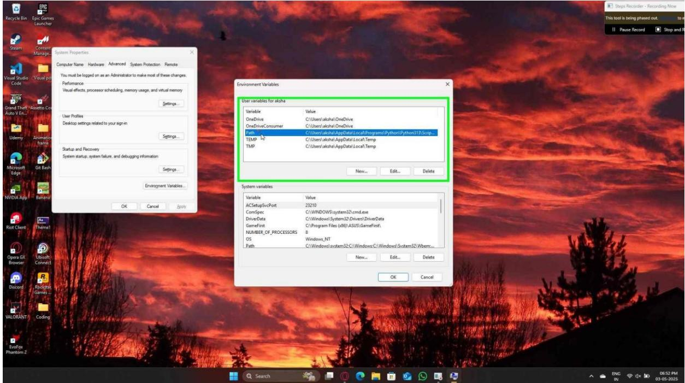
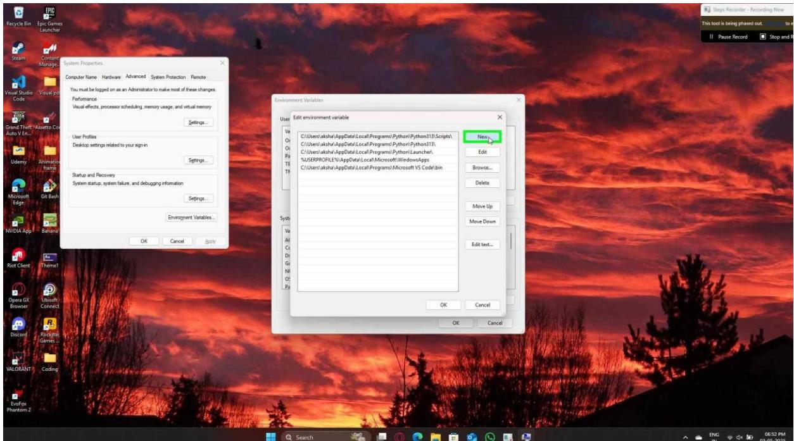

**Step 1:** User keyboard input on "Search (window)" in "Search" [... Enter]

Step 1 screenshot.

**Step 2:** User left click on "Environment Variables... (button)" in "System Properties"

Step 2 screenshot.

# Exit Slide Show [*Loading next slide...*] Pause

Previous

**Step 2:** User left click on "Environment Variables... (button)" in "System Properties"

Step 2 screenshot.

# Exit Slide Show

User left click on "Path (text)" in "Environment Variables"

Previous Next

#### Resume slide show

**Step 3:User left clicks on "Path(text)" in "Environment Variables"**

### Exit Slide Show

Previous Next

User left click on "Path (text)" in "Environment Variables"

Step 3 screenshot.

[*Loading next slide...*] Pause

**Step 3:**

Exit Slide Show

User left click on "Path (text)" in "Environment Variables"

Previous Next

Step 3 screenshot.

### Exit Slide Show

Previous Next

User left click on "Path (text)" in "Environment Variables"

#### Resume slide show

**Step 4:**

### Exit Slide Show

Previous Next

User left click on "Path (text)" in "Environment Variables"

Step 4 screenshot.

[*Loading next slide...*] Pause

**Step 4:**

Exit Slide Show

User left click on "Path (text)" in "Environment Variables"

Previous Next

Step 4 screenshot.

# Exit Slide Show Return to first slide

Previous

**Step 5:** User left click on "New (button)" in "Edit environment variable"

Step 5 screenshot.

# Exit Slide Show Restart slide show

Previous

**Step 5:** User left click on "New (button)" in "Edit environment variable"

Step 5 screenshot.