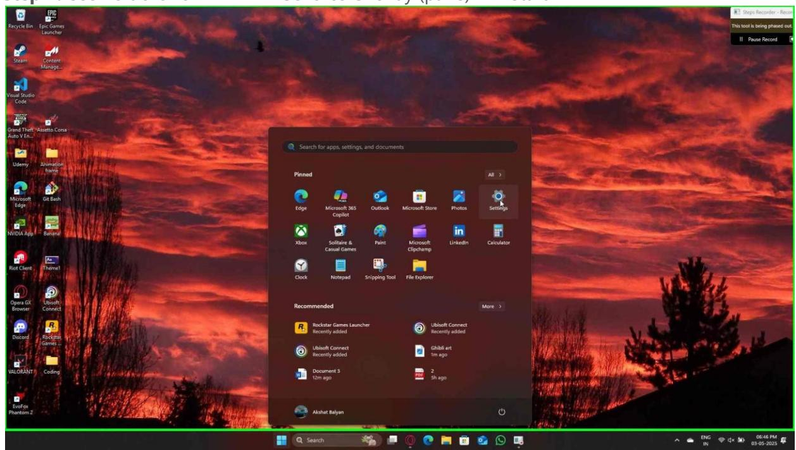

**Step 1:** User left click on "NVIDIA GeForce Overlay (pane)" in "Start"

Step 1 screenshot.

**Step 2:** User left click on "System (list item)" in "Settings"

Step 2 screenshot.

**Step 3:** User left click on "Display (group)" in "Settings"

Step 3 screenshot.

| First 0 Recycle Bin Epic Games Launcher P 841 | < Settings                                                                                                                                                                    | ロ X                                                                                           | Ra Steps Recorder - Recorp This tool is being phased out. II Pause Record |
|--------------------------------------------------------------|-------------------------------------------------------------------------------------------------------------------------------------------------------------------------------|--------------------------------------------------------------------------------------------------|---------------------------------------------------------------------------------|
| Steam Content Manage 지 Fisual Studio             | Akshat Balyan Carres akshat_balyan@outlook.com                                                                                                                          | System > Display                                                                                 |                                                                                 |
| Code 第 200                                             | a Find a setting                                                                                                                                                           |                                                                                                  |                                                                                 |
| Grand Theft Assetto Corsa Auto V En. ्ट्रिय            | Home System                                                                                                                                                                | 2                                                                                                |                                                                                 |
| Udemy Animation frame C A                        | Bluetooth & devices Network & internet                                                                                                                                     |                                                                                                  |                                                                                 |
| Microsoft Git Bash                                        | Personalization Apps                                                                                                                                                       | Show only on 2 ~ ldentify                                                                     |                                                                                 |
| 新闻 12 NVIDIA App Banana                             | Accounts Time & language                                                                                                                                                   | Multiple displays ு V Choose the presentation mode for your displays                    |                                                                                 |
| 费 ﻟﻊ Riot Client Thernel                            | Gaming Accessibility                                                                                                                                                       | Brightness & color o- Night light Off @ > Use warmer colors to help block blue light |                                                                                 |
| 10 D Opera GX Ubisoft Beowser Connect         | Privacy & security @ Windows Update                                                                                                                                        | 8 Color profile > Determine how colors appear on your screen                               |                                                                                 |
| B 18 Discord Rockstar Games 2                    |                                                                                                                                                                               | HDR ම > More about HDR                                                                  |                                                                                 |
| VALORANT Coding 1611-2461                                 |                                                                                                                                                                               | Scale & layout                                                                                   |                                                                                 |
| 0 Evol ox                                                 |                                                                                                                                                                               | Scale Change the size of text, apps, and other items ට >>                                  |                                                                                 |
| Phantom 2                                                    | A - D H / C / C / 0 / 0 / 0 / 0 / 0 / 0 / 0 / 0 / 0 / 0 / 0 / 0 / 0 / 0 / 0 / 0 / 0 / 0 / 0 / 0 / 0 / 0 / 0 / 0 / 0 / 0 / 0 / 0 / 0 / 0 / 0 / 0 / 0 / 0 / 0 / 0 / 0 / 0 / 0 / | Display resolution = Q. Search > > > = = 0 C ■ ■ 0 0 円 0 0 円 0                                | ~ = < ENG @ @x 10 03-05-2025                                                    |

**Step 4:** User mouse wheel down on "Color profile (group)" in "Settings"

Step 4 screenshot.

| 网                                           | File                      |                                             |                                                                                  |                              | Ind Steps Recorder - Record                       |
|---------------------------------------------|---------------------------|---------------------------------------------|----------------------------------------------------------------------------------|------------------------------|---------------------------------------------------|
| Recycle Bin Epic Games                      | Launcher                  |                                             |                                                                                  |                              | This tool is being phased out. II Pause Record |
| P Steam                                  | 24 Content             | < Settings                                  |                                                                                  | - 口 X                     |                                                   |
| 彩 Visual Studio                          | Manage                    | Akshat Balyan akshat_balyan@outlook.com  | System > Display                                                                 |                              |                                                   |
| Code                                        |                           | a Find a setting                         |                                                                                  | ldentify Show only on 2 y |                                                   |
| 路 Grand Theft Assetto Corsa Auto V En | 日                         | Home   System                            | Multiple displays ு Choose the presentation mode for your displays         | V                            |                                                   |
| ्ट्रिय Udemy                             | Animation frame        | Bluetooth & devices · Network & internet | Brightness & color                                                               |                              |                                                   |
| C Microsoft                              | A Git Bash             | Personalization                             | Night light -0- Use warmer colors to help block blue light                 | Off @ >                      |                                                   |
| Edge NOW App 1                           | 能 Banana               | Apps Accounts                            | Color profile 8 Determine how colors appear on your screen                 | >                            |                                                   |
| 费 Riot Client                            | 200 Thernel            | Time & language Gaming                   | HDR 网 More about HDR 9                                                  | >                            |                                                   |
|                                             |                           | Accessibility                               | Scale & layout                                                                   |                              |                                                   |
| 50 Opera GX Beowser                   | @ Ubisoft Connect   | Privacy & security Windows Update        | Scale ට Change the size of text, apps, and other items                     | 4 >                          |                                                   |
| 8 Discord                                | 12 Rockstar Games . |                                             | Display resolution 100 Adjust the resolution to fit your connected display |                              |                                                   |
| 12 VALORANT Cading                       | 1611/23 15 25             |                                             | Bosplay.orientation                                                              |                              |                                                   |
| 0                                           |                           |                                             | Related settings                                                                 |                              |                                                   |
| EvoFox Phantom 2                         |                           | and and of the state -                      | Advanced display 0 Display information, refresh rate                       | >                            |                                                   |

**Step 5:** User mouse wheel up on "More about HDR (text)" in "Settings"

Step 5 screenshot.

| D First Recycle Bin Epic Garnes Launcher           |                                                          |                                                                                                                                |                          | Ra Steps Recorder - Record This tool is being phased out. |
|----------------------------------------------------------------|----------------------------------------------------------|--------------------------------------------------------------------------------------------------------------------------------|--------------------------|--------------------------------------------------------------|
| P 24 Steam Content Manage 彩                     | ← Settings Akshat Balyan akshat_balyan@outlook.com | System > Display                                                                                                               | - 0 × PENN ALLY SUL C | II Pause Record                                              |
| isual Studio Code 部 200 Grand Theft Assetto Corsa  | a Find a setting Home                              | Multiple displays 0 Choose the presentation mode for your displays                                                       | >                        |                                                              |
| Auto V En ्रय Udemy Animation frame                | System Bluetooth & devices · Network & internet    | Brightness & color Night light o Use warmer colors to help block blue light                                           | Off @ ) >                |                                                              |
| P A Microsoft Git Bash Edge 的 8              | Personalization Apps Accounts                      | Color profile A Determine how colors appear on your screen HDR 圈 More about HDR                                 | > >                   |                                                              |
| MDIA App 1 Banana 100 Acres Riot Client Thernel | Time & language Gaming A Accessibility             | Scale & layout Scale                                                                                                        |                          |                                                              |
| 60 D Opera GX Ubisoft Connect Browser           | Privacy & security C Windows Update                   | 6 Change the size of text, apps, and other items (Display resolution Adjust the resolution to fit your connected display | V >                      |                                                              |
| 8 12 Discord Rockstar Games 2 VALORANT Cading   |                                                          | Display onentation Related settings                                                                                         |                          |                                                              |
| 611/2466 0 EvolFox Phantom 2 10                    |                                                          | Advanced display 0 Display information, refresh rate                                                                     | >                        |                                                              |
|                                                                | Company of the comments of the                           | Graphics ■ Q Search > > ■ ◎ ○ 四 回 ◎ ■ ◎ ■ ◎ ■ ◎ ■ ◎ ■ ◎ ■ ◎ ■ ◎ ■ ◎ ■ ◎ ■ ◎ ■ ◎ ■ ◎ ■ ◎ ■ 0                                 |                          | 06:46 PM 03-05-2025 ^ = < ENG @ < k lo                    |

**Step 6:** User mouse wheel down on "Settings (window)" in "Settings"

Step 6 screenshot.

| Piciti e Recycle Bin Epic Games               |                                                                              |                                                                                 |         | An Steps Recorder - Record This tool is being phased out. |
|-----------------------------------------------------|------------------------------------------------------------------------------|---------------------------------------------------------------------------------|---------|--------------------------------------------------------------|
| Launcher                                            |                                                                              |                                                                                 | - 0 ×   | II Pause Record                                              |
| P 841 Steam Content Manage              | < Settings                                                                   |                                                                                 |         |                                                              |
| 彩                                                   | Akshat Balyan Acres of the akshat_balyan@outlook.com                   | System > Display Night light -ଡ଼-                                         | Off @ > |                                                              |
| Visual Studio Code                               | Q Find a setting                                                          | Use warmer colors to help block blue light                                      |         |                                                              |
| 第 100 Grand Theft Assetto Corsa Auto V En. | A Home                                                                       | Color profile A Determine how colors appear on your screen                | >       |                                                              |
| ਦੁੱਧ                                                | System                                                                       | HDR More about HDR 网                                                         | >       |                                                              |
| Udemy Animation frame                         | Bluetooth & devices                                                          |                                                                                 |         |                                                              |
| 6 A                                              | · Network & internet 1 Personalization                                 | Scale & layout                                                                  |         |                                                              |
| Microsoft Git Bash                               | Apps                                                                         | Scale  Change the size of text, apps, and other items 6                      | ~ >     |                                                              |
| 留 能 NVIDIA App Banana                      | Accounts                                                                     | [[]] Display resolution Atliust the resolution to fit your connected display |         |                                                              |
| 10                                                  | Time & language                                                              |                                                                                 |         |                                                              |
| ﻟﻘ Riot Client Thernel                        | Gaming Accessibility                                                      | Display onentation                                                              |         |                                                              |
| 10 D                                             | Privacy & security                                                           | Related settings                                                                |         |                                                              |
| Opera GX Ubisoft Beowser Connect           | C Windows Update                                                             | Advanced display 01 4 Display information, refresh rate                | >       |                                                              |
| 8 12 Discord Rockstar Games -           |                                                                              | Graphics                                                                        | >       |                                                              |
|                                                     |                                                                              |                                                                                 |         |                                                              |
| VALORANT Coding 16103152                         |                                                                              | Related support                                                                 |         |                                                              |
| 0 EvoFox                                         |                                                                              | Help with Display                                                               | A       |                                                              |
| Phantom 2 10                                     | ---------------------------------------------------------------------------- |                                                                                 |         |                                                              |
|                                                     |                                                                              | Q Search 第 ■ 0 @ ■ ■ ● ■ ◎                                                |         | ~ = < ENG @ <x > 0 03-05-2025                                |

**Step 7:** User left click on "Settings (window)" in "Settings"

Step 7 screenshot.

**Step 8:** User left click on "Display 1: Internal Display (list item)" in "Settings"

Step 8 screenshot.

**Step 9:** User left click on "Display 2: LG FHD (text)" in "Settings"

Step 9 screenshot.

**Step 10:** User left click on "Refresh rate (combo box)" in "Settings"

Step 10 screenshot.

Previous

**Step 11:** User left click on "100 Hz (text)" in "Settings"

Step 11 screenshot.